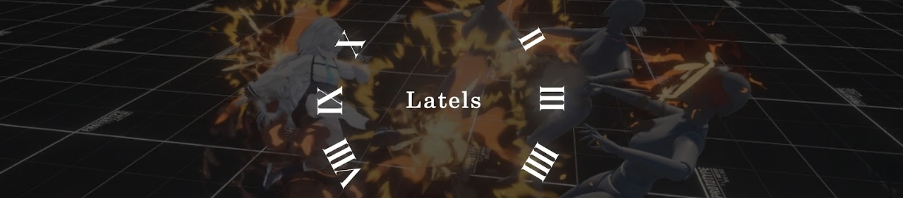

# Latels



## 📌 목차

- [프로젝트 소개](#-프로젝트-소개)
- [개발 환경](#️-개발-환경)
- [핵심 플레이](#️-핵심-플레이)
- [트러블슈팅](#-트러블슈팅)
- [아키텍처](#️-아키텍처)
- [전체 기능 목록](#-전체-기능-목록)
- [핵심 기술](#-핵심-기술)
- [프로젝트 구조](#-프로젝트-구조)

<br>

## 🎮 프로젝트 소개
> 1인 개발 | [📽️ 플레이 영상](https://youtu.be/hkEzeteNLy0?si=PBl-unxJ25RFDuDz) | 2026.02 ~ 

Latels는 스텔라소라, 퍼니싱 그레이 레이븐을 레퍼런스로 한 쿼터뷰 3D 액션 게임입니다.

퍼니싱 그레이 레이븐에서 회피 성공 시 시간이 느려지며 반격하는 순간의 쾌감에 주목했고, 이를 쿼터뷰 환경에서 재현하는 것을 핵심 목표로 개발을 시작했습니다. 자동 락온 기반 전투, 불렛타임 회피, 대쉬 스택/버퍼 등 액션 게임의 핵심 메카닉을 직접 설계하고 구현했습니다.

- 메인/지원 캐릭터를 편성하여 스테이지에 진입, 자동 락온 전투와 회피/스킬로 적을 처치
- 플레이어와 적의 시간 흐름을 독립 분리한 불렛타임 시스템
- 상태 패턴 + 이벤트 기반의 확장 가능한 구조

<br>

## 🛠️ 개발 환경

| 항목 | 내용 |
|------|------|
| 엔진 | Unity 2022.3.62f3 |
| 언어 | C# |
| IDE | Rider |
| 플랫폼 | Windows |

<br>

## ⚔️ 핵심 플레이

### 자동 락온 전투

|  |  |
|:---:|:---:|
| 자동 락온 | 이동공격 |

`OverlapSphereNonAlloc`으로 범위 내 적을 탐색하고, 가장 가까운 적에게 자동 락온이 됩니다.
매 프레임 탐색이 발생하여 `OverlapSphere`로는 매번 배열이 할당되므로, GC 부하를 없애기 위해 `NonAlloc` 을 사용했습니다.

이동 중 공격 시 전신이 공격 모션으로 전환되면 이동감이 사라지는 문제가 있어, Animator Layer를 상체/하체로 분리하고 Weight를 Lerp로 전환하여 이동하면서 자연스럽게 공격하는 블렌딩을 구현했습니다.

<br>

### 불렛타임 회피

|  |  |
|:---:|:---:|
| 불렛타임 | 퍼펙트 닷지 |

적의 공격 범위(DangerZone) 안에서 대쉬하면 완벽 회피 판정이 되며, 슬로우 모션이 발동됩니다.

불렛타임은 내부적으로 쿨타임을 가지며, 쿨타임 중 완벽 회피 시 퍼펙트 닷지가 발동됩니다.

`Time.timeScale`만 낮추면 플레이어까지 느려지기 때문에, `PlayerDelta` / `EnemyDelta` 이중 시간 구조를 설계하여 플레이어는 정상 속도를 유지하면서 적만 느려지도록 구현했습니다.

<br>

### 대쉬 버퍼

|  |  |
|:---:|:---:|
| 대쉬 예약 | 충전식 대쉬 |

대쉬는 총 3회까지 충전이 가능하며, 재사용 쿨타임이 끝나면 연속하여 대쉬할 수 있습니다.

스킬 사용 중 대쉬 입력이 막히면 조작감이 답답해지기 때문에, 스킬 끝자락의 입력을 버퍼에 저장하여 스킬 종료 즉시 대쉬가 실행되도록 구현했습니다.

대쉬 후 이동을 유지하면 스프린트(달리기)로 자동 전환되며, 스프린트 중에는 공격이 불가합니다.

<br>

## 🔧 트러블슈팅

### 1. 불렛타임 시간 분리 - 플레이어와 적의 시간을 독립적으로 제어

**문제**<br>
> 회피 성공 시 적만 느려지고 플레이어는 정상 속도로 움직이는 불렛타임을 구현해야 했습니다. Unity의 `Time.timeScale`을 낮추면 모든 오브젝트가 동일하게 느려지기 때문에, 플레이어와 적의 시간을 따로 제어할 방법이 필요했습니다.

**분석**<br>
> `Time.unscaledDeltaTime`을 사용하면 timeScale의 영향을 받지 않지만, 완벽 회피 직후 화면이 잠시 멈추는 히트스탑 연출이나 클리어 슬로우 연출에서는 플레이어도 함께 느려져야 합니다. 즉, 상황에 따라 플레이어의 시간 흐름이 달라져야 하는 문제였습니다.

**해결**<br>
> TimeManager에서 두 가지 시간 흐름(delta)을 제공하는 구조를 설계했습니다. 플레이어의 이동/대쉬/스킬은 PlayerDelta를, 적의 추적/공격은 EnemyDelta를 사용합니다. Animator도 `updateMode = UnscaledTime`으로 전환하여 애니메이션 속도까지 분리했습니다.

| 상황 | PlayerDelta (플레이어용) | EnemyDelta (Enemy 용) |
|------|------|------|
| 평시 | `unscaledDeltaTime` (timeScale 무시) | `Time.deltaTime` (timeScale 적용) |
| 불렛타임 | `unscaledDeltaTime` → 정상 속도 유지 | `Time.deltaTime` → 느려짐 |
| 히트스탑 | `unscaledDeltaTime * 0.6f` → 60% 속도 | `Time.deltaTime` → 거의 정지 (5%) |

**관련 스크립트**<br>
> [TimeManager.cs](https://github.com/Minssuy99/Latels/blob/main/Assets/01_Scripts/Manager/TimeManager.cs) · [PlayerMovement.cs](https://github.com/Minssuy99/Latels/blob/main/Assets/01_Scripts/Player/PlayerMovement.cs) · [PlayerDash.cs](https://github.com/Minssuy99/Latels/blob/main/Assets/01_Scripts/Player/PlayerDash.cs) · [DodgeDetector.cs](https://github.com/Minssuy99/Latels/blob/main/Assets/01_Scripts/Player/DodgeDetector.cs)

<br>

### 2. 불렛타임 중 적에게 연속 공격이 안 되는 버그

**문제**<br>
> 불렛타임 중 적을 연속으로 공격해도 첫 번째 타격만 적용되고, 이후 공격이 전부 무시되는 버그가 발생했습니다.

**분석**<br>
> 적에게는 같은 공격에 두 번 맞지 않도록 피격 쿨다운(0.075초) 타이머가 있습니다. 이 타이머가 적의 시간(EnemyDelta) 기준으로 감소하고 있었는데, 불렛타임 중 적의 시간은 20배 느리게 흐르므로 0.075초 쿨다운이 실제로는 **1.5초**나 걸렸습니다. 그 사이 플레이어가 정상 속도로 여러 번 공격해도 쿨다운이 안 풀려서 전부 무시된 것입니다.

**해결**<br>
> 피격 쿨다운 타이머를 플레이어의 시간(PlayerDelta) 기준으로 변경했습니다. "언제 다시 맞을 수 있는가"는 플레이어의 공격 속도에 맞춰야 하므로, 플레이어 시간 기준이 올바른 선택이었습니다.

**관련 스크립트**<br>
> [EnemyHealth.cs](https://github.com/Minssuy99/Latels/blob/main/Assets/01_Scripts/Enemy/EnemyHealth.cs)

<br>

### 3. 피격 시스템 개편 - 애니메이션 레이어 블렌딩 충돌

**문제**<br>
> 피격 시 상체 전용 Animator Layer에서 피격 모션을 재생하고 있었는데, 공격이나 대쉬 중 피격되면 상체에서 두 모션이 동시에 블렌딩되어 애니메이션이 부자연스럽게 보이는 현상이 발생했습니다.

**분석**<br>
> 공격/대쉬/피격이 각각 다른 레이어에서 재생되며, 같은 상체 본에 여러 모션이 겹치는 구조적 문제였습니다. 피격 레이어의 Weight를 즉시 0으로 내려도 전환 시 시각적 끊김이 발생했습니다.

**해결**<br>
> 피격 전용 레이어 자체를 삭제하고, 시각 피드백을 화면 가장자리 붉은 효과(비네트) + 적 머테리얼 플래시로 대체했습니다. 레이어 간 충돌 가능성을 원천 제거하여, 피격 중에도 대쉬/스킬 등 모든 행동이 자연스럽게 연결됩니다.

**관련 스크립트**<br>
> [PlayerHealth.cs](https://github.com/Minssuy99/Latels/blob/main/Assets/01_Scripts/Player/PlayerHealth.cs) · [VignetteUI.cs](https://github.com/Minssuy99/Latels/blob/main/Assets/01_Scripts/UI/InGame/VignetteUI.cs) · [EnemyHitEffect.cs](https://github.com/Minssuy99/Latels/blob/main/Assets/01_Scripts/Enemy/EnemyHitEffect.cs)

<br>

### 4. 적 Root Motion 공격 중 플레이어에게 밀리는 현상

**문제**<br>
> 적이 Root Motion 기반으로 공격할 때, 플레이어와 충돌하면 적의 위치가 밀려나면서 공격 궤적이 어긋나는 현상이 발생했습니다.

**분석**<br>
> NavMeshAgent가 활성화된 상태에서 Root Motion으로 이동하면, Agent가 위치를 관리하려는 로직과 Root Motion이 충돌합니다. 외부 충돌에 의해 Agent의 위치가 밀리면, Root Motion 애니메이션의 의도된 이동 경로가 무너집니다.

**해결**<br>
> 공격/피격 상태 진입 시 `agent.updatePosition = false`로 설정하여 NavMeshAgent의 위치 관리를 끄고, Root Motion이 직접 위치를 제어하도록 했습니다. 상태 종료 시 `agent.Warp(transform.position)`으로 현재 위치를 Agent에 동기화한 후, `updatePosition = true`로 복구합니다.

**관련 스크립트**<br>
> [EnemyAttackState.cs](https://github.com/Minssuy99/Latels/blob/main/Assets/01_Scripts/Enemy/State/EnemyAttackState.cs) · [EnemyHitState.cs](https://github.com/Minssuy99/Latels/blob/main/Assets/01_Scripts/Enemy/State/EnemyHitState.cs)

<br>

<details>
<summary><b>기타 해결 사항</b></summary>

| 문제 | 해결 |
|------|------|
| DontDestroyOnLoad 싱글톤의 Inspector 참조 깨짐 | 싱글톤이 씬 오브젝트를 직접 참조하지 않는 구조로 변경, 씬 내 스크립트가 `Instance`에 코드로 접근 |
| CharacterController 충돌/경사면에서 위로 뜨는 현상 | 착지 시 `groundStickForce(-5f)` 적용 + `movedThisFrame` 플래그로 이동 없는 프레임에도 중력 적용 |
| 불렛타임 중 적 피격 시 공격 끊김 | IsSlowMotion 체크 → HitState 전환 없이 데미지만 적용 |
| 적 사망 후 AnimationEvent가 NavMesh 에러 유발 | DeadState 체크 추가로 상태 전환 무시 |
| DOTween 씬 전환 시 이전 Tween 간섭 | 씬 로딩 직전 DOTween.KillAll() |
| 불렛타임 중 완벽 회피 중복 발동 | IsNormalSpeed 조건 추가로 중복 방지 |

</details>

<br>

## 🏗️ 아키텍처

### 상태 패턴 (플레이어 / 적)

상태별 진입/갱신/종료 로직을 분리하여, if-else 분기 없이 상태를 추가/수정할 수 있는 구조.

```
IState
├── PlayerBaseState (abstract)
│   ├── IdleState     - 입력 대기, 락온/공격 레이어 관리
│   ├── MoveState     - CharacterController 이동
│   ├── DashState     - 무적 이동, 스프린트 분기
│   ├── SkillState    - 캐릭터별 스킬 위임
│   ├── SprintState   - 고속 이동, 락온 해제
│   └── DeadState     - 컴포넌트 비활성화
│
└── EnemyBaseState (abstract)
    ├── InactiveState - 플레이어 사망 시 대기
    ├── ReadyState    - Area 진입 시 준비
    ├── ChaseState    - NavMeshAgent 추적
    ├── AttackState   - Root Motion 공격
    ├── HitState      - 피격 처리
    └── DeadState     - SinkAndDestroy
```

### 캐릭터 확장 구조

캐릭터마다 공격/스킬 로직이 다르지만 공통 인터페이스를 유지하기 위해, 추상 클래스 상속 + Prefab Variant 구조 적용.

```
BaseCharacter (공통 컴포넌트)
└── 캐릭터 Base (모델/아바타, Prefab Variant)
    ├── 캐릭터_Battle (전투 스크립트)
    └── 캐릭터_Display (로비 전용)

PlayerAttack (abstract)    → 캐릭터별 공격 구현
PlayerMainSkill (abstract) → 캐릭터별 스킬 구현
```

<br>

## 📋 전체 기능 목록

<details>
<summary><b>플레이어</b></summary>

| 기능 | 설명 |
|------|------|
| 이동/회전 | CharacterController + Slerp 보간, 조이스틱/키보드 입력 |
| 락온 | OverlapSphereNonAlloc 기반 자동 탐색, 8방향 Strafe |
| 자동 공격 | 정지: 전신(Layer 1) / 이동: 상체(Layer 2), Weight Lerp 전환 |
| 대쉬 | 3스택 충전식, 대쉬 버퍼, 재사용 딜레이 |
| 불렛타임 회피 | DangerZone 감지 + 완벽 회피 판정, 슬로우 모션 |
| 스프린트 | 대쉬 후 이동 유지 시 자동 전환 |
| 피격 | 피격 쿨다운 기반 이중 피격 방지, OnDamaged 이벤트 |

</details>

<details>
<summary><b>캐릭터 시스템</b></summary>

| 기능 | 설명 |
|------|------|
| Prefab Variant 3단 구조 | BaseCharacter → Battle/Display, SetRole()에서 역할별 활성화 |
| 근접 캐릭터 | 히트박스 AnimationEvent 제어, 메인스킬: 텔레포트 → 다단히트 |
| 원거리 캐릭터 | 12발 장전/Reload, Animation Rigging 조준, 메인스킬: 범위 공격 |
| 지원 캐릭터 | 소환 → 퇴장 프레임워크 구현, 쿨타임 관리 (캐릭터별 고유 스킬 구현 예정) |

</details>

<details>
<summary><b>적 AI</b></summary>

| 기능 | 설명 |
|------|------|
| 추적 | NavMeshAgent 기반, 직접 LookAt 회전 |
| 공격 | 랜덤 AttackType, Root Motion 기반, DangerZone 콜라이더 |
| 슈퍼아머 | 일정 횟수 피격 후 다음 공격 보장 |
| 피격 이펙트 | 머테리얼 플래시(HitFlash) + 흔들림(HitShake) |

</details>

<details>
<summary><b>타임 시스템</b></summary>

| 기능 | 설명 |
|------|------|
| PlayerDelta / EnemyDelta | 플레이어/적 시간 흐름 독립 분리 |
| 히트스탑 | timeScale 0.05f + 플레이어 Animator.speed 보정 |
| 불렛타임 | 4초 지속, 쿨타임 15초, Bloom tint 시각 효과 |
| 일시정지 | Pause/Resume, 일시정지를 존중하는 커스텀 대기 코루틴 |
| 파티클 관리 | 불렛타임 진입/해제 시 활성 파티클 시간 모드 전체 갱신 |

</details>

<details>
<summary><b>스테이지 · UI · 이펙트</b></summary>

| 기능 | 설명 |
|------|------|
| 스테이지 자동 수집 | SpawnPoint/Gate를 계층 구조에서 자동 탐색 |
| 클리어 연출 | 5단계 코루틴 (히트스탑 → 페이드 → 도어 → 카메라 → 리절트) |
| 스택 네비게이션 | UIManager: Stack\<UIScreen\>, FullScreen/Popup 분리 |
| 인게임 HUD | HP바(트레일), 대쉬 게이지, 스킬 쿨타임, 보스HP, 데미지팝업, 락온 인디케이터 |
| 데미지 팝업 | 방향 기반 스폰, 타입별 색상, 카메라 빌보드 |
| 오브젝트 풀링 | Dictionary\<GameObject, Queue\> 기반, 지연 반환 |

</details>

<br>

## 🎯 핵심 기술

| 분류 | 기술 |
|------|------|
| 설계 패턴 | 상태 패턴(State Pattern), 이벤트 기반 설계, 추상 클래스 상속 구조 |
| 시간 제어 | 히트스탑 / 불렛타임 / 일시정지 통합 TimeManager |
| 최적화 | 오브젝트 풀링, NonAlloc API (GC 할당 방지) |
| 데이터 관리 | ScriptableObject 기반 데이터 드리븐 |
| UI | 스택 기반 네비게이션, DOTween 애니메이션 |
| 캐릭터 구조 | Prefab Variant 3단 구조, Animation Rigging |

<br>

## 📁 프로젝트 구조

```
Assets/01_Scripts/
├── Player/          # 플레이어 시스템 (상태, 이동, 공격, 피격, 대쉬, 스킬)
├── Character/       # 캐릭터별 고유 구현 (근접, 원거리)
├── Enemy/           # 적 AI (상태, 공격, 피격, 시각효과)
├── Interface/       # 인터페이스 (IState, IDamageable, IBattleComponent 등)
├── Camera/          # 카메라 추적
├── Manager/         # 싱글톤 매니저 (Game, UI, Time, Pool, Stage, Fade, Setting)
├── Data/            # ScriptableObject (Character, Enemy, Chapter, Stage)
├── Stage/           # 스테이지 시스템 (Area, SpawnPoint, ClearDirector)
├── Constants/       # 상수 클래스 (AnimHash, GameTags)
├── Debug/           # 테스트/디버그 유틸리티
└── UI/
    ├── InGame/      # 인게임 HUD (HP바, 대쉬, 스킬, 보스HP, 데미지팝업)
    └── Lobby/       # 로비 화면 (챕터, 스테이지, 캐릭터선택, 설정)
        └── Settings/  # 환경설정 패널
```